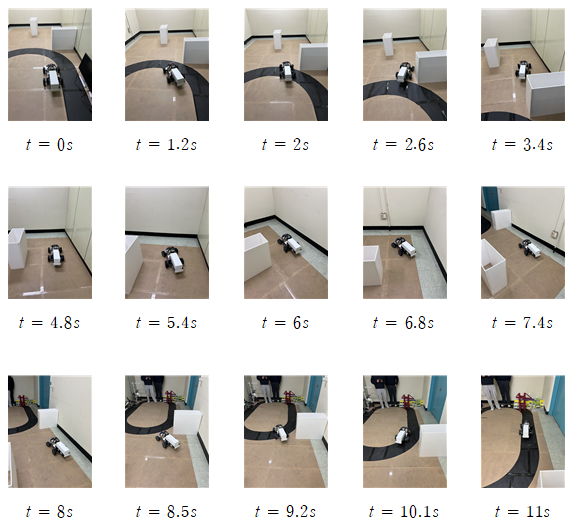
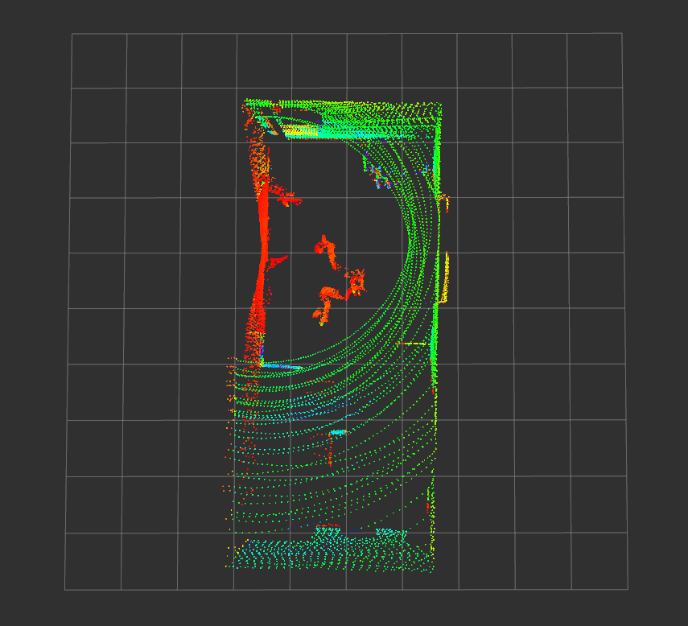
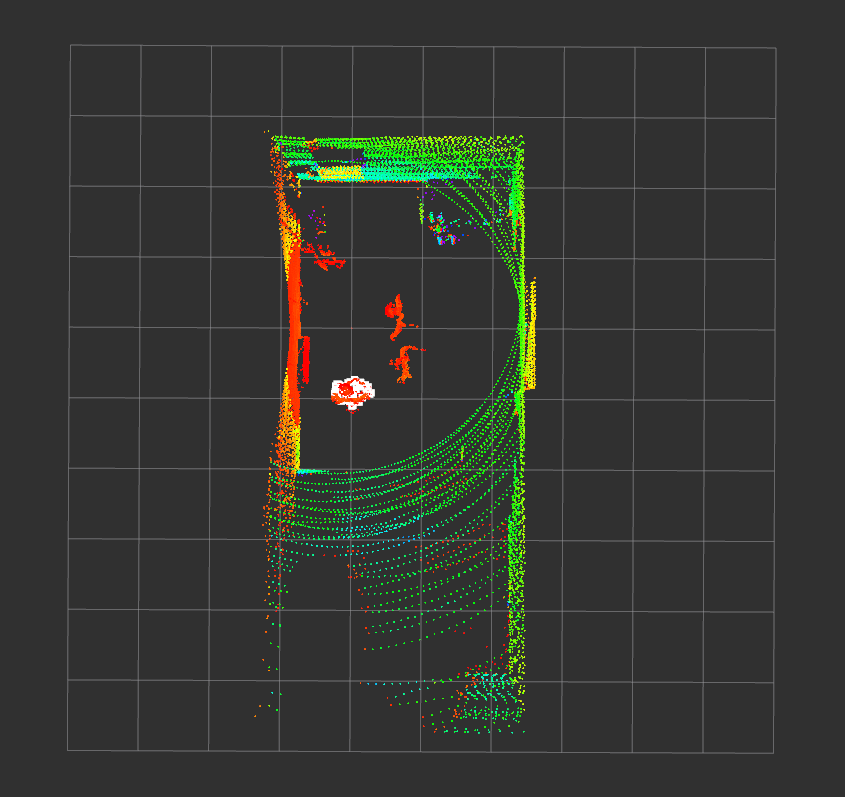
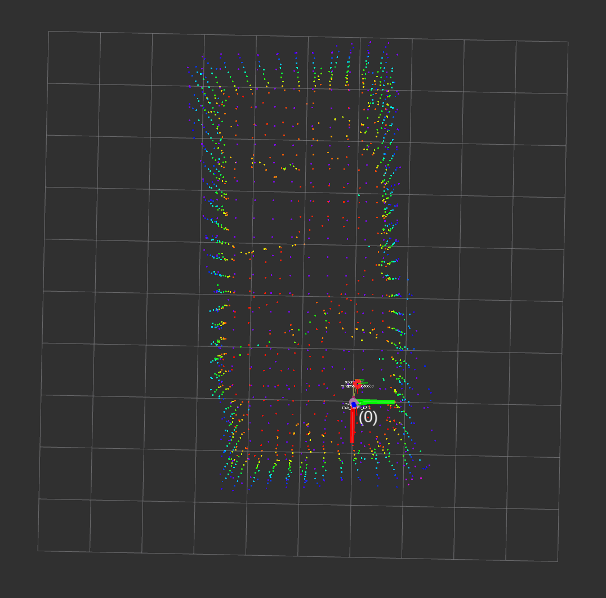
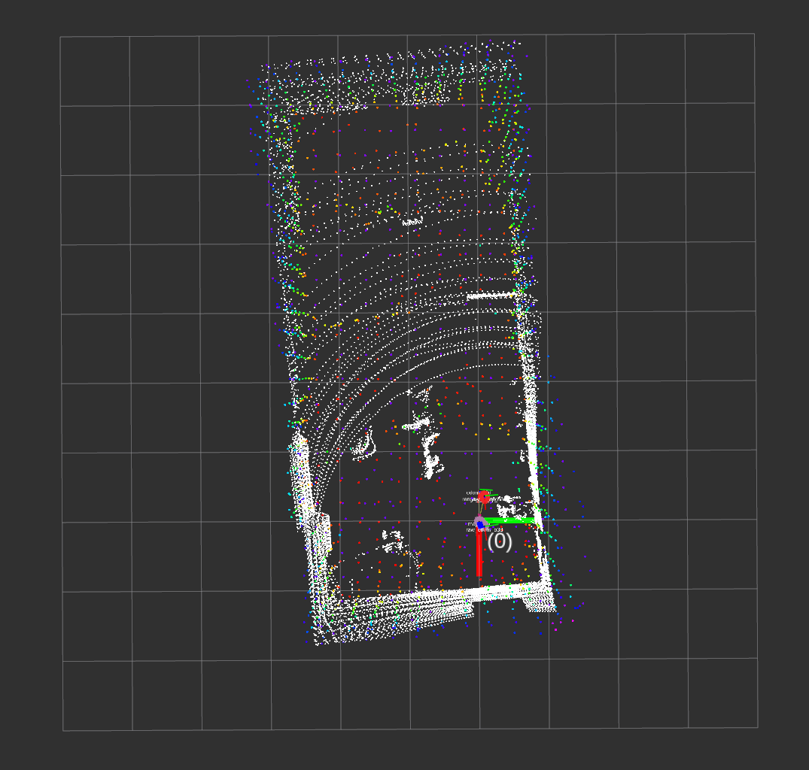
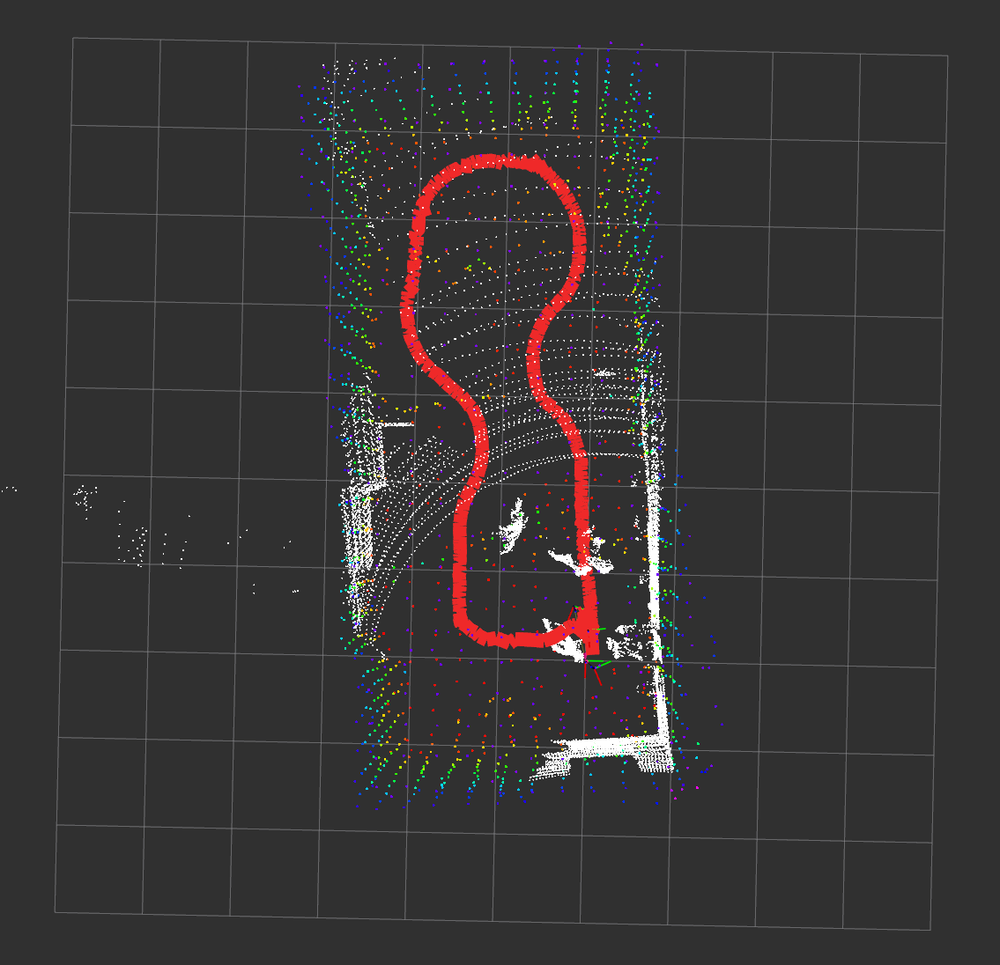
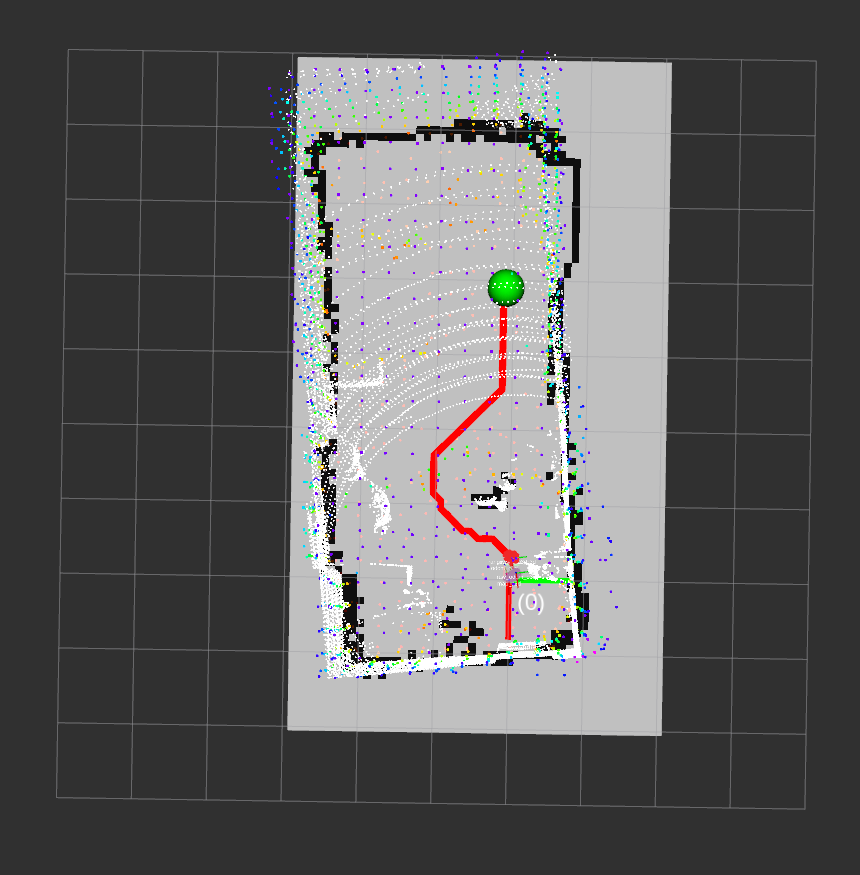
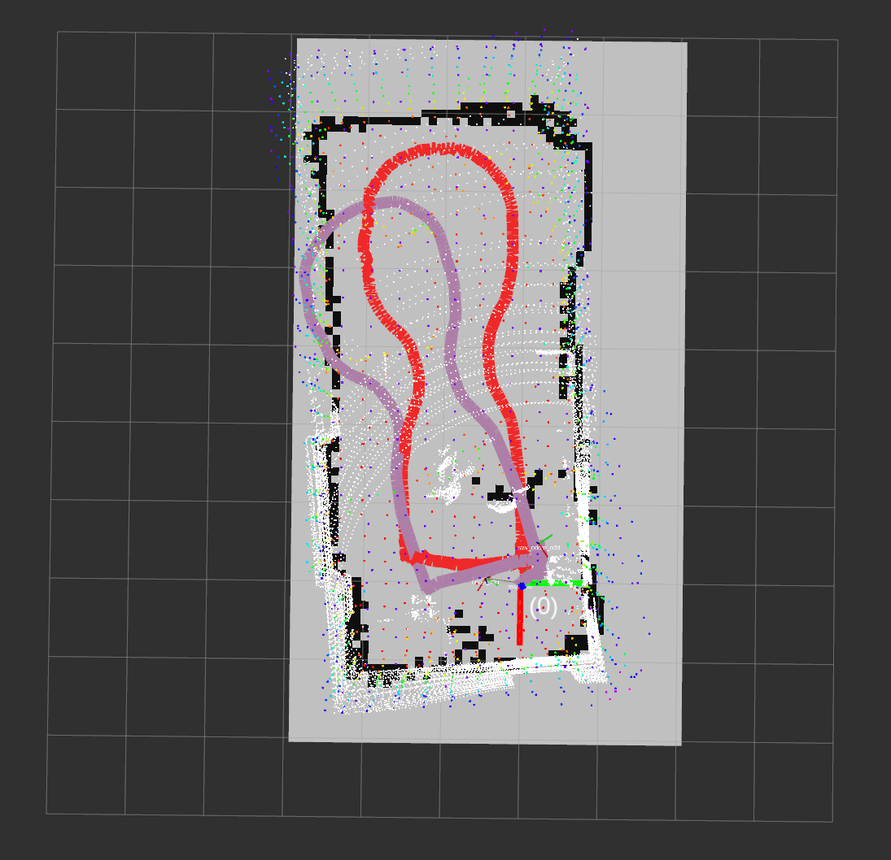
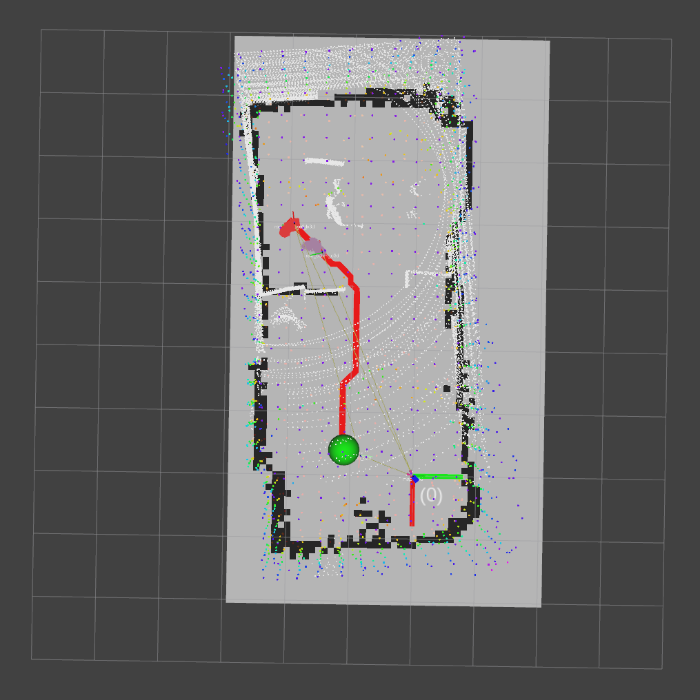

<!DOCTYPE html>
<html lang="ko">
<head>
    <meta charset="UTF-8">
    <meta name="viewport" content="width=device-width, initial-scale=1.0">
    <title>Capstone Design</title>
</head>
<body>
    <h1>Capstone Design</h1>
    
인하대학교 기계공학 종합설계 "물류 운송을 위한 임베디드 시스템의 자율 운송에 대한 연구"

    
    
    
    
    
    
    
    
    
</body>
</html>
